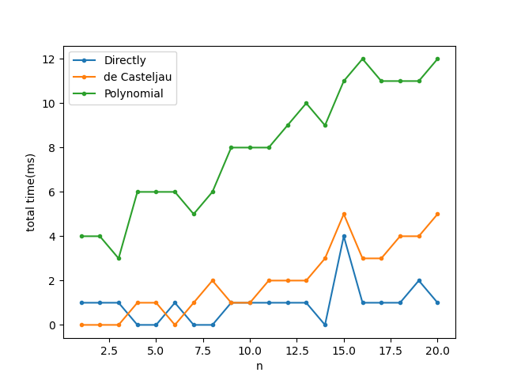

# Bezier曲线与多项式曲线的转化、求值方法介绍与对比

软博21 沈冠霖 2021312593

## 1.理论基础

### 1.1 Bezier曲线转多项式曲线

$$
公式推导：
Bezier曲线方程C(t)=\sum_{i=0}^{n}P_iB_{i,n}(t)，其中P_i为第i个控制顶点坐标。\\
多项式曲线方程D(t)=\sum_{j=0}^{n}Q_jt^j，其中Q_j为第j次项系数。\\
Bernstein基函数B_{i, n}(t)=\frac{n!}{i!(n-i)!}t^i(1-t)^{n-i}\\
设其第j项系数为B_{i,n,j},根据二项式定理，
B_{i,n,j}=\left\{
\begin{array}{}
0 & {j < i}\\
(-1)^{j-i}\frac{n!}{i!(n-i)!}\dbinom{n-i}{j-i}&{j \geq i}
\end{array} \right.\\
回到多项式曲线方程，有第j次项系数Q_j=\sum_{i=0}^{n}P_iB_{i,n,j}=\sum_{i=0}^{j}P_i(-1)^{j-i}\dbinom{n-i}{j-i}\frac{n!}{i!(n-i)!}\\
根据组合数性质，\dbinom{n-i}{j-i}=\frac{(n-i)!}{(n-j)!(j-i)!}，代入上个式子，有
Q_j=\sum_{i=0}^{j}(-1)^{j-i}P_i\frac{n!}{i!(n-j)!(j-i)!}\\
算法设计：
求解这个问题需要频繁进行从0!到n!的阶乘运算，因此考虑进行预处理，提前计算0到n的阶乘并且存储。\\
之后每次计算Q_j需要计算j+1项，每项的计算复杂度为O(1)，总共需要计算\sum_{j=0}^{n}j+1项。
综上所述，算法复杂度为O(n^2)。
$$

### 1.2 多项式曲线转Bezier曲线

$$
公式推导：设Bernstein基函数第j项系数为B_{i,n,j},根据二项式定理，
B_{i,n,j}=\left\{
\begin{array}{}
0 & {j < i}\\
(-1)^{j-i}\frac{n!}{i!(n-j)!(j-i)!} & j \geq i
\end{array} \right.\\
将所有的B_{i,n,j}组成一个矩阵B,使得B[j][i]=B_{i,n,j}，此时B[i][j]代表第j个Bernstein基函数在t^i的系数。\\
显然有B为(n+1)*(n+1)的下三角矩阵，且其对角线元素均不为0，其行列式也不为0，为可逆矩阵。\\
设n+1维向量p_x, p_y的第i维为Bezier曲线第i个控制顶点的x，y坐标，n+1维向量q_x,q_y的第i维为多项式曲线x，y坐标在t^i项的系数。\\
则有Bp_x=q_x，Bp_y=q_y。因为B为可逆矩阵，所以理论上有p_x=B^{-1}q_x，p_y=B^{-1}q_y。\\
算法设计：
实际上，因为B为下三角矩阵，所以没有必要使用矩阵求逆算法，可以使用高斯消元算法来求解，具体步骤如下：\\
对于p向量第i维的求解，首先将前i-1维的解代入，求解其与B矩阵前i-1行的乘积之和，然后根据q向量的值反推p向量第i维的解。\\
这样每一维的求解花费O(n)的时间，求解每个方程组花费O(n^2)的时间，一共两个方程组，算法复杂度为O(n^2)。
$$

### 1.3 多项式曲线求值

$$
可以通过一遍循环完成求值：使用一个变量记录t^j的值，每次循环先更新t^j的值再求Q_jt^j，再加上去即可。
算法复杂度O(n)。
$$

### 1.4 Bezier曲线直接求值

$$
首先，可以事先存储0!到n!的数值、t^0到t^n的数值、还有(1-t)^0到(1-t)^n的数值，这三个预先计算每个复杂度都是O(n)。\\
之后，可以通过一次循环得到最终结果：每次先根据存储好的数值计算出B_{i,n}(t)的数值，再求得P_iB_{i,n}(t)，再加上去。\\
综上所述，算法复杂度为O(n)。
$$

### 1.5 de Casteljau算法

$$
de Casteljau算法是Bezier曲线求值的重要算法，推导和证明过程这里不再赘述，这里只陈述其表达式和计算复杂度。\\
P_i^k=\left\{
\begin{array}{}
P_i & k = 0\\
(1 - t)P_i^{k - 1} + tP_{i + 1}^{k - 1} & k = 1,2....,n& i = 0, 1,...,n-k
\end{array} \right.其中P_0^n为待求的曲线值。算法图解见下图。\\
可以看出，一共需要记录n(n+1)/2个中间状态，每个中间状态都需要运算，因此算法复杂度为O(n^2)。\\
$$

## 2.实验设计和结果

### 2.1 实验环境

系统：Windows 10

CPU：11th Gen Intel(R) Core(TM) i7-11800H @ 2.30GHz   2.30 GHz

内存：32GB

编程语言：C++ 11

编程环境：vs code

控制顶点和曲线求值坐标我都使用的double（双精度浮点数），占8位。

实验中最大误差对应的顶点这里暂不展示，参见max_points文件夹，里面有我全部实验的最大误差对应的顶点。

### 2.2 多项式曲线和Bezier曲线互相转换

我首先设计了五组简单数据，进行对拍测试，数据如下，代码位于main.cpp文件的TestExamples()函数下。

| 阶数 | 贝塞尔曲线控制顶点             | 多项式曲线方程         | 是否正确 |
| ---- | ------------------------------ | ---------------------- | -------- |
| 1    | (0, 0), (1, 1)                 | x = t, y = t           | 是       |
| 1    | (1, 3), (4, 5)                 | x = 3t + 1, y = 2t + 3 | 是       |
| 2    | (0, 0), (1, 1), (2, 0)         | x = 2t, y = -2t^2 + 2t | 是       |
| 2    | (1, 2), (3, 4), (5, 6)         | x = 4t + 1, y = 4t + 2 | 是       |
| 3    | (0, 0), (1, 1), (2, 1), (3, 0) | x = 3t, y = -3t^2 + 3t | 是       |

之后我采用了随机对拍的方法进行测试。对于阶数n=1到20的20种情况，每种我都生成了10条随机贝塞尔曲线，保证控制顶点坐标在[-1e6,1e6]之间。我使用我实现的算法将贝塞尔曲线转化成多项式曲线，再转化为贝塞尔曲线，再转化为多项式曲线，如果两条贝塞尔曲线和多项式曲线一致，则说明转化正确。考虑到浮点运算的误差，我设定正确的标准为对应顶点欧几里得距离不超过1e-5。

经过测试，对于1到20的阶数，我的互相转化方法都正确。当阶数进一步提升，阶乘运算会导致浮点数溢出，转化错误。

综上所述，在阶数不是特别大（1到20）的时候，我的互相转化算法是正确的。由于贝塞尔曲线实际使用中通常是3阶等，阶数不会特别大，因此我的算法可以胜任实际需求。

### 2.3 曲线求值精度

我仍然采用随机化的方法进行测试。

首先，要比较求值算法的精度，就应该有一个标准。我设置按照定义求曲线的值是完全准确的，其他方法可能有误差。度量误差的标准我选择是结果坐标的欧几里得距离，度量平均距离和最大距离两个指标。

其次，我们需要考虑多个维度的因素，一是曲线阶数n，二是顶点坐标范围，三是t的取值范围，我采用控制变量法，保证其他两个因素不变，只调整一个因素。

最终，为了更好地度量精度，我采用多次重复试验的方法，每种情况重复实验1000次。

#### 2.3.1 不同阶数下，求值精度对比

这里，我固定t的范围为[0, 1]，顶点坐标范围为[-1e6, 1e6]。

##### 贝塞尔曲线求值

| 阶数                     | 4        | 8        | 12       | 16       | 20       |
| ------------------------ | -------- | -------- | -------- | -------- | -------- |
| de Casteljau（平均误差） | 6.92e-11 | 7.84e-11 | 8.75e-11 | 9.14e-11 | 9.74e-11 |
| 转化为多项式（平均误差） | 2.78e-10 | 8.53e-9  | 3.37e-7  | 1.70e-5  | 1.23e-3  |
| de Casteljau（最大误差） | 3.68e-10 | 3.78e-10 | 5.21e-10 | 8.18e-10 | 8.17e-10 |
| 转化为多项式（最大误差） | 2.69e-9  | 1.22e-7  | 1.09e-5  | 4.71e-4  | 4.46e-2  |

可以看出，在阶数n较小时，两种方法的误差均较小。随着阶数增大，转化为多项式求解的误差指数级上升，而de Casteljau算法的误差基本不变。

##### 多项式曲线求值

| 阶数                                       | 4        | 8       | 12      | 16      | 20      |
| ------------------------------------------ | -------- | ------- | ------- | ------- | ------- |
| 转化为Bezier，然后de Casteljau（平均误差） | 1.39e-10 | 2.13e-9 | 1.60e-7 | 1.37e-5 | 7.48e-4 |
| 转化为Bezier，然后按照定义（平均误差）     | 1.39e-10 | 2.13e-9 | 1.60e-7 | 1.37e-5 | 7.48e-4 |
| 转化为Bezier，然后de Casteljau（最大误差） | 1.39e-7  | 2.13e-6 | 1.60e-4 | 1.37e-2 | 0.75    |
| 转化为Bezier，然后按照定义（最大误差）     | 9.31e-10 | 5.17e-8 | 5.53e-6 | 3.9e-4  | 0.05    |

（两种方法的均值曲线基本重合）

可以看出，两种方法的误差基本上差不多，转化成Bezier再按定义的最大值更小，更加稳定。两种方法的误差在阶数较小的时候较小，随着阶数增加，两种方法的误差指数级增加。

#### 2.3.2 不同顶点坐标范围下，求值精度对比

这里，我固定阶数为20，t范围为[0, 1]。

##### 贝塞尔曲线求值

| 顶点坐标范围             | [-1e-6,1e-6] | [-1e-4,1e-4] | [-1e-2,1e-2] | [-1,1]   | [-10,10] | [-1e2,1e2] | [-1e4,1e4] | [-1e6,1e6] |
| ------------------------ | ------------ | ------------ | ------------ | -------- | -------- | ---------- | ---------- | ---------- |
| de Casteljau（平均误差） | 9.97e-23     | 1.01e-20     | 9.85e-19     | 1.01e-16 | 1.00e-15 | 9.69e-15   | 9.66e-13   | 9.74e-11   |
| 转化为多项式（平均误差） | 3.53e-15     | 3.55e-13     | 3.21e-11     | 3.43e-9  | 3.94e-8  | 3.19e-7    | 1.32e-5    | 1.23e-3    |
| de Casteljau（最大误差） | 5.70e-22     | 7.30e-20     | 6.25e-18     | 9.42e-16 | 7.54e-15 | 7.65e-14   | 5.75e-12   | 8.17e-10   |
| 转化为多项式（最大误差） | 9.65e-14     | 9.99e-12     | 9.70e-10     | 9.35e-8  | 1.70e-6  | 1.31e-5    | 3.64e-4    | 4.46e-2    |

可以看出，随着坐标范围的增大，误差也在逐渐增大。但是de Casteljau算法的精度一致高于转化为多项式再求解的精度。

##### 多项式曲线求值

| 顶点坐标范围                               | [-1e-6,1e-6] | [-1e-4,1e-4] | [-1e-2,1e-2] | [-1,1]  | [-10,10] | [-1e2,1e2] | [-1e4,1e4] | [-1e6,1e6] |
| ------------------------------------------ | ------------ | ------------ | ------------ | ------- | -------- | ---------- | ---------- | ---------- |
| 转化为Bezier，然后de Casteljau（平均误差） | 1.18e-15     | 1.11e-13     | 1.13e-11     | 1.10e-9 | 1.15e-8  | 1.05e-7    | 8.53e-6    | 7.48e-4    |
| 转化为Bezier，然后按照定义（平均误差）     | 1.18e-15     | 1.11e-13     | 1.13e-11     | 1.10e-9 | 1.15e-8  | 1.05e-7    | 8.53e-6    | 7.48e-4    |
| 转化为Bezier，然后de Casteljau（最大误差） | 1.18e-12     | 1.11e-10     | 1.13e-8      | 1.10e-6 | 1.15e-5  | 1.05e-4    | 8.53e-3    | 0.75       |
| 转化为Bezier，然后按照定义（最大误差）     | 5.86e-14     | 4.68e-12     | 4.61e-10     | 3.78e-8 | 3.40e-7  | 2.79e-6    | 3.64e-3    | 0.05       |

（两种方法的均值曲线基本重合）

可以看出，随着坐标范围的增大，误差也在逐渐增大。但是两种算法精度差不多。最大值方面，按照定义的Bezier求解更小，相对稳定一点。

#### 2.3.3 不同顶点坐标范围下，求值精度对比

这里，我固定阶数为20，顶点坐标范围为[1000, 1000]。

##### 贝塞尔曲线求值

| t范围                    | [0,1]    | [0,0.2]  | [0.8,1]   | [0.4,0.6] | [0.2,0.8] |
| ------------------------ | -------- | -------- | --------- | --------- | --------- |
| de Casteljau（平均误差） | 9.64e-14 | 1.22e-13 | 1.16e-013 | 8.03e-14  | 8.40e-14  |
| 转化为多项式（平均误差） | 1.77e-6  | 1.43e-12 | 7.79e-6   | 1.43e-8   | 1.38e-7   |
| de Casteljau（最大误差） | 6.92e-13 | 6.84e-13 | 6.82e-13  | 5.70e-13  | 4.69e-13  |
| 转化为多项式（最大误差） | 6.38e-5  | 1.38e-11 | 5.51e-5   | 1.25e-7   | 3.22e-6   |

可以看出，当t越小，求值精度就越高。而无论t如何取值，de Casteljau算法都比转化成多项式更精确。

##### 多项式曲线求值

| t范围                                      | [0,1]   | [0,0.2]  | [0.8,1] | [0.4,0.6] | [0.2,0.8] |
| ------------------------------------------ | ------- | -------- | ------- | --------- | --------- |
| 转化为Bezier，然后de Casteljau（平均误差） | 1.11e-6 | 1.02e-12 | 5.10e-6 | 8.39e-9   | 9.44e-8   |
| 转化为Bezier，然后按照定义（平均误差）     | 1.11e-6 | 1.02e-12 | 5.10e-6 | 8.39e-9   | 9.44e-8   |
| 转化为Bezier，然后de Casteljau（最大误差） | 1.11e-3 | 1.02e-9  | 5.10e-3 | 8.39e-9   | 9.44e-5   |
| 转化为Bezier，然后de Casteljau（最大误差） | 3.37e-5 | 1.45e-11 | 5.04e-5 | 1.30e-7   | 2.76e-6   |

可以看出，当t越小，求值精度就越高。而无论t如何取值， 两种算法精度都大致相同。

#### 2.4 求值速度

我仍然采用随机化的方法进行测试。

我固定t的范围为[0, 1]，顶点坐标范围为[-1e6, 1e6]。

我采用多次重复试验的方法，每种情况重复实验1000次，计算总时间。

##### 贝塞尔曲线求值

| 阶数                               | 4 | 8 | 12 | 16 | 20 |
| ---------------------------------- | - | - | -- | -- | -- |
| 直接求解（总时间，单位：毫秒）     | 0 | 0 | 1  | 1  | 1  |
| de Casteljau（总时间，单位：毫秒） | 1 | 2 | 2  | 3  | 5  |
| 转化为多项式（总时间，单位：毫秒） | 6 | 6 | 9  | 12 | 12 |

可以看出，时间效率上，直接求解>de Casteljau算法>转化为多项式

##### 多项式曲线求值

| 阶数                                                 | 4 | 8  | 12 | 16 | 20 |
| ---------------------------------------------------- | - | -- | -- | -- | -- |
| 直接求解（总时间，单位：毫秒）                       | 1 | 1  | 1  | 1  | 1  |
| 转化为Bezier，然后de Casteljau（总时间，单位：毫秒） | 6 | 10 | 11 | 17 | 17 |
| 转化为Bezier，然后按照定义（总时间，单位：毫秒）     | 6 | 10 | 10 | 14 | 13 |

可以看出，时间效率上，直接求解>转化为Bezier曲线再直接求解>转化为贝塞尔曲线再de Casteljau算法

## 3.分析和总结

### 3.1 正确性

首先，从互相转化算法的正确性上，无论是我设计的数据还是随机生成的数据，我都能保证对应点误差在1e-5以内，说明互相转化算法正确。

之后，从求值算法的正确性上，以直接求值为基准，在绝大多数情况下，可以保证求值的精度在1e-3以内，相对坐标点的范围来说并不是很大，可以说明我的求值算法都实现正确。

### 3.2 求值效率和准确率

对于Bezier曲线，直接按照定义求解是速度最快、准确率最高的，毕竟复杂度只有O(n)。使用de Casteljau算法速度和准确率其次，因为是O(n^2)的算法，且不比直接按照定义求解差特别多。而先转化为多项式再求值则在速度和准确率上都比较差，不仅有O(n^2)的运算开销，还有两种数据结构相关的其他系统开销。

对于多项式曲线，直接求解无论是速度还是准确率都是很高的。转化为Bezier曲线，无论是用哪种方法求解，速度和准确率都差不多，毕竟都需要O(n^2)的运算开销和数据结构相关的系统开销。

在实际生产中，Bezier曲线只需要定义控制点即可，而多项式曲线的定义更为抽象，Bezier曲线更为实用。而Bezier曲线的求解上，转化为多项式无论是速度还是精确度都不够；按照定义求解虽然速度和准确率都略高，但是要求阶乘，而阶乘随着n的增加会产生溢出；de Casteljau算法则是一个递推算法，不会有溢出情况，而且其速度和准确率都不逊色直接求解太多，因此是首选。综上所述，在实际生产中，应当采用Bezier曲线，用de Casteljau算法进行求值。
